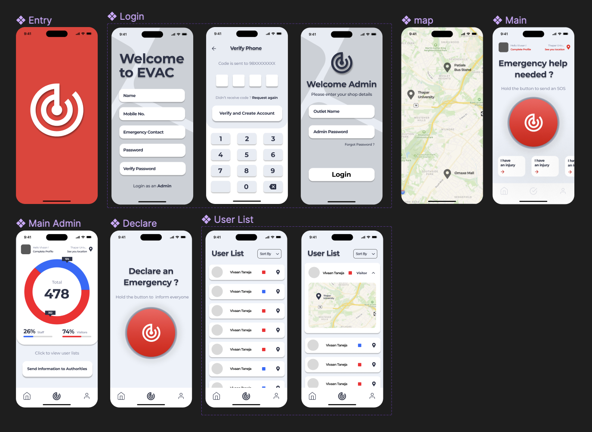
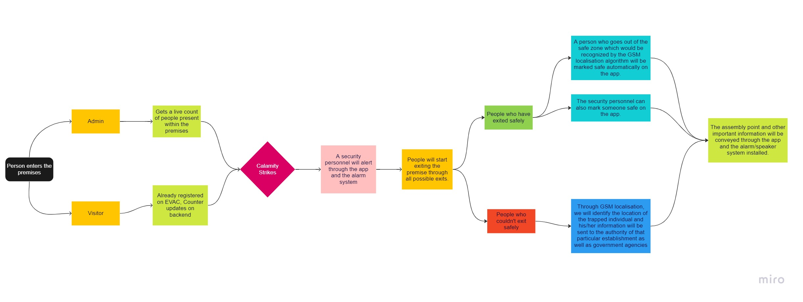

# EVAC
Imagine with me the aftercourse of a natural calamity, after it hits -rescue teams are called. Now, the teams have no information about the number of people inside the premises, their location. This arrangement poses a lot of problems as the efforts of the rescue operations are going to be unconcentrated leading to higher response time to victims.  
 

## The solution
EVAC is a full-stack soltuion to reduce reaction time drastically in the face of calamity. EVAC brings together multiple technologies to provide a solution that makes people's lives safer in the face of disaster. 

 

## How it works
There are two sides to the app i.e the User end and the Admin end 

### User end: 
After quickly registering on the app, Whenever a user steps out of their home and enters an outlet, the app will first ask for a confirmation. Following this, the backend will be updated with the users' details and their current GPS pin. Now, As a person reaches a safe space or exits the n-meter radius of the establishment, the live count will be updated accordingly. Further, if any person is stuck/injured, they can communicate directly with the authorities through the SOS functionality.

### Admin end: 
The concerned authority of outlet will have to register themselves into the application previously with parameters like radius, working hours, etc. Following this, their establishment will be available on the map. Whenever a person/employee walks into the n-metre ratius of the outlet, the counter will be updated on the backend-only visible to a set of authorised people. Now, as a calamity strikes - the authorized personnel will have the option to declare it through the SOS button on the admin panel which will send a notification to all the users inside the premises. Subsequently, the live counter will be shared with government rescue agencies, and the authorities will have access to the locations of those still inside their premises. 

## The User Interface

## Flowchart
Here's a quick look over the flow of the application

Here's a peek:  

## Tech Stack

  
  

## Getting Started

This project is a starting point for a Flutter application.

A few resources to get you started if this is your first Flutter project:

- [Lab: Write your first Flutter app](https://docs.flutter.dev/get-started/codelab)
- [Cookbook: Useful Flutter samples](https://docs.flutter.dev/cookbook)

For help getting started with Flutter development, view the
[online documentation](https://docs.flutter.dev/), which offers tutorials,
samples, guidance on mobile development, and a full API reference.
